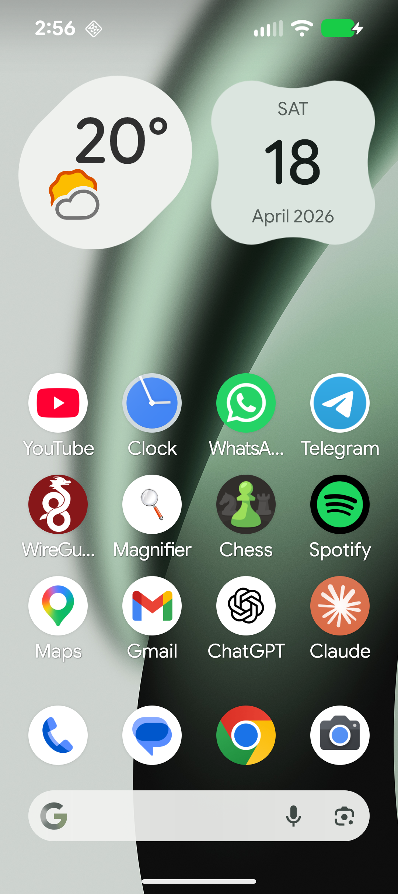

# Date Widget

A modern, Material 3 Pixel-style Android home-screen widget shaped like a 4-leaf clover, showing today's weekday, day number, month, and year.

> **Note**: The entire codebase for this project was written by AI (Claude / Windsurf Cascade).



## Download

Don't want to build from source? Grab the signed release APK directly:

**[📦 date-widget.apk](./release/date-widget.apk)**

Sideload it on your Android device (you'll need to enable "Install from unknown sources" for your browser/file manager).

## Requirements
- **JDK**: 17 or newer
- **minSdk**: 26 · **targetSdk**: 37 · **compileSdk**: 37
- **AGP**: 9.3.1 · **Gradle**: 9.6.1 · **Kotlin**: 2.4.10

## First-time setup

Release builds are signed from a gitignored `keystore.properties` in the project root:

```properties
storeFile=../release-keystore.jks
storePassword=…
keyAlias=release
keyPassword=…
```

Without it, release builds fall back to the debug signing key.

This project ships without the Gradle wrapper JAR (binaries aren't committed). Generate it once:

```bash
# If you have a system Gradle >= 9.6
gradle wrapper --gradle-version 9.6.1

# OR just open the folder in Android Studio — it will bootstrap the wrapper automatically.
```

## Build & install

```bash
./gradlew :app:installDebug
```

Then on the device: long-press home screen → Widgets → **Clover Date** → drag onto home screen.

## Architecture

| File | Role |
| --- | --- |
| `DateWidget.kt` | Glance composable: clover background + text + Today pill, size-aware (compact vs regular). |
| `DateWidgetReceiver.kt` | `GlanceAppWidgetReceiver`, listens for date/time/timezone/locale changes. |
| `DateUpdateWorker.kt` | `CoroutineWorker` that refreshes at local midnight via WorkManager. |
| `MainActivity.kt` | Minimal launcher screen with an "add widget" hint. |
| `res/drawable/bg_clover.xml` | `VectorDrawable` with the 4-leaf clover path and a radial purple gradient. `drawable-night/` overrides for dark theme. |
| `res/drawable/bg_today_pill.xml` | Rounded shape drawable for the pill. |
| `res/xml/date_widget_info.xml` | AppWidget provider metadata (2×2 minimum, resizable). |

## Design notes

- **Shape**: baked as a `VectorDrawable` path because `RemoteViews` can't host Jetpack Compose shapes at runtime.
- **Gradient**: `<gradient android:type="radial">` inside the vector (API 24+).
- **Dark theme**: via `res/values-night/` + `res/drawable-night/`.
- **Wallpaper-dynamic color (Android 12+)**: the `-v31` and `-night-v31` resource qualifiers bind the clover gradient stops, text, and pill fill to `@android:color/system_accent1_*` so the widget automatically re-tints to match the user's wallpaper palette. On Android 8.0–11, it falls back to the static Material 3 purple palette.

## Tapping the widget

Opens the system Calendar app at today's date (`CalendarContract.CONTENT_URI/time/<now>`).

## Wiki

Detailed design decisions, architecture notes, and development history are documented in the [wiki/](./wiki/Home.md).
